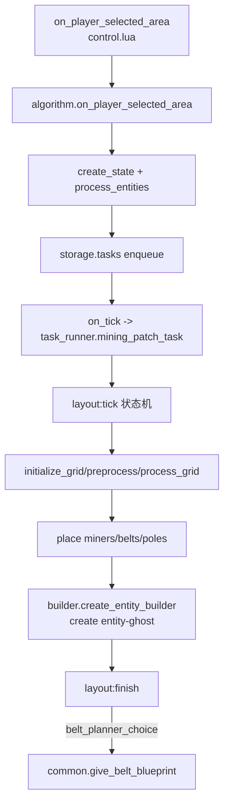
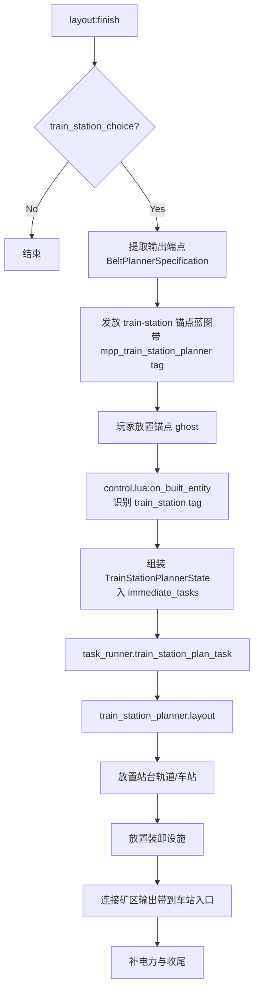

# Mining Patch Planner 蓝图生成过程分析 & 传送带到火车站流程图

## 1) 现有蓝图生成过程（代码路径）

### 入口：玩家框选矿区
1. `control.lua` 监听 `on_player_selected_area`，当工具是 `mining-patch-planner` 时调用 `algorithm.on_player_selected_area(event)`。  
2. `algorithm.create_state()` 把 GUI 配置（布局、矿机、皮带、电线杆、过滤选项等）写入 `state`。  
3. `algorithm.process_entities()` 筛选资源、计算包围盒坐标 `coords`，并确认矿物/矿机可用性。  
4. 校验通过后，任务 `state` 被放进 `storage.tasks`，由 `on_tick -> task_runner.mining_patch_task()` 逐帧驱动布局生成。

### 核心：布局状态机逐步生成蓝图对象
以 `layouts/simple.lua` 为代表：
1. `layout:start()` 进入状态机（先清理上次 ghost）。
2. `initialize_grid -> preprocess_grid -> process_grid`：
   - 建立虚拟网格
   - 卷积资源密度、避水/避悬崖
   - 形成可放置矿机候选
3. `place_miners -> place_belts -> place_poles -> place_lamps`（不同布局细节有差异）：
   - 把矿机、传送带、电线杆等写入 `builder_*` 规格列表
4. `builder.create_entity_builder()` 将网格坐标转换为世界坐标并 `surface.create_entity("entity-ghost")`。
5. `finish()` 收尾：打印统计、渲染信息；若开启 belt planner，则生成一张“后续拉带蓝图”。

### Belt Planner（现有“从矿区输出继续拉带”）
1. `layouts/common.lua::give_belt_blueprint(state)`：
   - 从 `state.belts` 抽取输出带端点
   - 生成 `BeltPlannerSpecification`
   - 给玩家一个临时蓝图（标记 `mpp_belt_planner=main/delete`）
2. 玩家放置这张蓝图后，`control.lua::on_built_entity` 捕获标记 belt ghost：
   - 读取上一份 `BeltPlannerSpecification`
   - 把落点坐标变换到布局局部坐标
   - 组装 `BeltinatorState` 加到 `storage.immediate_tasks`
3. `task_runner.belt_plan_task()` 调用 `mpp/belt_planner.lua::layout(state)`：
   - 计算转角/横线/竖线段
   - 生成新的皮带 ghost。

---

## 2) 新增“传送带到火车站蓝图”建议代码流程

> 目标：在现有 Belt Planner 基础上，再增加“连接到火车站卸/装载接口”的自动蓝图。

### 建议新增模块
- `mpp/train_station_planner.lua`（新）
  - 输入：`BeltPlannerSpecification` + 站点参数（站台方向、站名、车厢数、每节车厢装卸口数量、平衡器策略）。
  - 输出：`TrainStationPlan`（站台实体 + 装卸箱/装卸机 + 接驳皮带主干）。

### 建议扩展状态
- 在 `State` / `MinimumPreservedState` 增加 `train_station_choice` 与 `train_station_options`。
- 在 `PlayerData` 增加 train-station planner 的暂存栈（类似 `belt_planner_stack`）。

### 建议事件流
1. 生成矿区蓝图完成后（`layout:finish`），若 `train_station_choice=true`：
   - 先走现有输出端采样逻辑（复用 `common.give_belt_blueprint` 的端点提取）。
   - 给玩家一张“火车站锚点蓝图”（可带 tag：`mpp_train_station_planner=main`）。
2. 玩家放置锚点后，`control.lua::on_built_entity` 新增分支：
   - 解析锚点方向、位置、站点参数。
   - 组装 `TrainStationPlannerState` 入 `storage.immediate_tasks`。
3. `task_runner` 增加 `train_station_plan_task(state)`：
   - 调 `train_station_planner.layout(state)`
   - 分阶段放置：站台轨道 -> 站点实体 -> 装卸设施 -> 皮带汇流/分流 -> 电力补全。

### 关键复用点
- 坐标/方向变换：复用 `mpp_util.coord_convert/coord_revert`。
- ghost 构建：复用 `builder.create_entity_builder()`。
- 输出端点输入：复用 `BeltPlannerSpecification`（可扩展字段如 lane group / throughput）。
- 任务调度：复用 `storage.immediate_tasks + on_tick`。

---

## 3) 代码流程图（Mermaid）

### A. 现有蓝图生成总流程

### B. 新增“传送带到火车站”流程

